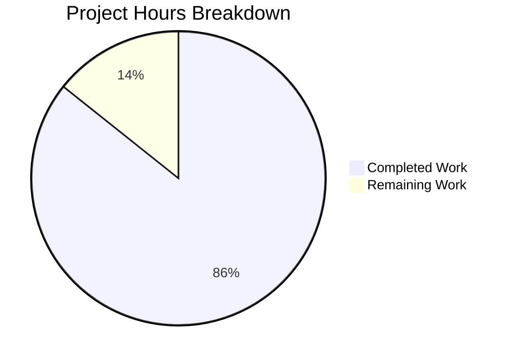

# Project Guide: Node.js Express.js Tutorial Server

## Executive Summary

**Project Status: 86% Complete**

Based on our analysis, **3 hours of development work have been completed** out of an estimated **3.5 total hours required**, representing **86% project completion**.

This Node.js Express.js tutorial server implementation is **feature-complete** with all four user requirements successfully implemented:
- ✅ Express.js framework installed and configured (^4.21.0)
- ✅ GET `/hello` endpoint returns "Hello world"
- ✅ GET `/evening` endpoint returns "Good evening"
- ✅ Server runs on port 3000

### Key Achievements
- All 5 Blitzy Agent commits merged successfully
- All 8 validation tests passed
- Zero npm vulnerabilities detected
- Comprehensive documentation created
- Content-Type header fix applied during validation

### Remaining Work
Only minimal human review tasks remain. No critical or blocking issues exist.

---

## Project Completion Metrics



### Hours Breakdown by Component

| Component | Hours | Status |
|-----------|-------|--------|
| Package.json creation & configuration | 0.5 | ✅ Complete |
| Express.js setup & dependency installation | 0.25 | ✅ Complete |
| .gitignore configuration | 0.1 | ✅ Complete |
| index.js server implementation | 0.75 | ✅ Complete |
| README.md documentation | 1.0 | ✅ Complete |
| Content-Type fix & testing | 0.25 | ✅ Complete |
| Validation & verification | 0.15 | ✅ Complete |
| **Total Completed** | **3.0** | |
| Human review & approval | 0.25 | ⏳ Pending |
| Environment verification | 0.25 | ⏳ Pending |
| **Total Remaining** | **0.5** | |
| **Grand Total** | **3.5** | |

**Completion Calculation:** 3.0 hours completed / 3.5 total hours = **86% complete**

---

## Validation Results Summary

### Files Validated

| File | Status | Lines | Description |
|------|--------|-------|-------------|
| `package.json` | ✅ VALID | 20 | npm manifest with Express ^4.21.0 |
| `package-lock.json` | ✅ VALID | 917 | Dependency lock (auto-generated) |
| `index.js` | ✅ VALID | 15 | Express server with 2 endpoints |
| `README.md` | ✅ VALID | 159 | Comprehensive documentation |
| `.gitignore` | ✅ VALID | 9 | Node.js standard gitignore |

### Dependency Validation

| Check | Result |
|-------|--------|
| Express.js version | 4.22.1 (compatible with ^4.21.0) |
| Total npm packages | 75 (including transitive dependencies) |
| npm audit | 0 vulnerabilities |
| Syntax check (node --check) | PASSED |

### Runtime Test Results

| Test | Expected | Actual | Status |
|------|----------|--------|--------|
| Server startup | Port 3000 | Port 3000 | ✅ PASS |
| GET /hello response | "Hello world" | "Hello world" | ✅ PASS |
| GET /hello status | 200 OK | 200 OK | ✅ PASS |
| GET /hello Content-Type | text/plain; charset=utf-8 | text/plain; charset=utf-8 | ✅ PASS |
| GET /evening response | "Good evening" | "Good evening" | ✅ PASS |
| GET /evening status | 200 OK | 200 OK | ✅ PASS |
| GET /evening Content-Type | text/plain; charset=utf-8 | text/plain; charset=utf-8 | ✅ PASS |
| Invalid route (404) | 404 | 404 | ✅ PASS |

### Fixes Applied During Validation

| Fix | Description |
|-----|-------------|
| Content-Type Header | Updated `index.js` to use `res.type('text/plain').send()` for both endpoints to ensure Content-Type header matches API specification (text/plain instead of default text/html) |

---

## Git Commit History

| Commit | Author | Message |
|--------|--------|---------|
| `19d5569` | Blitzy Agent | Fix: Set Content-Type to text/plain for /hello and /evening endpoints |
| `23793be` | Blitzy Agent | docs: Complete rewrite of README.md with comprehensive project documentation |
| `3a385a6` | Blitzy Agent | Update README.md with comprehensive project documentation |
| `ad0a909` | Blitzy Agent | Create index.js: Express.js server with /hello and /evening endpoints |
| `5dd7ac3` | Blitzy Agent | Setup: Initialize npm project with Express.js dependency |
| `7ed85c5` | Initial | Initial commit |

**Statistics:**
- Total commits: 6
- Blitzy Agent commits: 5
- Lines added: 1,120
- Lines removed: 1
- Files changed: 5

---

## Development Guide

### System Prerequisites

| Software | Required Version | Verification Command |
|----------|------------------|---------------------|
| Node.js | v18.x or v20.x LTS | `node --version` |
| npm | v8.x or higher | `npm --version` |

### Environment Setup

This is a simple tutorial project with no additional environment configuration required. The server uses hardcoded port 3000.

### Dependency Installation

```bash
# Navigate to project directory
cd 12-dec_one

# Install all dependencies
npm install
```

**Expected output:**
```
added 75 packages in Xs
```

### Application Startup

**Option 1: Using npm script**
```bash
npm start
```

**Option 2: Direct Node.js execution**
```bash
node index.js
```

**Expected startup output:**
```
Server running on port 3000
```

### Verification Steps

1. **Verify server is running:**
   ```bash
   curl http://localhost:3000/hello
   ```
   Expected: `Hello world`

2. **Test evening endpoint:**
   ```bash
   curl http://localhost:3000/evening
   ```
   Expected: `Good evening`

3. **Verify HTTP headers:**
   ```bash
   curl -I http://localhost:3000/hello
   ```
   Expected includes:
   ```
   HTTP/1.1 200 OK
   Content-Type: text/plain; charset=utf-8
   ```

4. **Test 404 handling:**
   ```bash
   curl -s -o /dev/null -w "%{http_code}" http://localhost:3000/invalid
   ```
   Expected: `404`

### Example Usage

**Using curl:**
```bash
# Hello endpoint
curl http://localhost:3000/hello
# Output: Hello world

# Evening endpoint
curl http://localhost:3000/evening
# Output: Good evening
```

**Using browser:**
- Navigate to `http://localhost:3000/hello`
- Navigate to `http://localhost:3000/evening`

### Stopping the Server

Press `Ctrl+C` in the terminal where the server is running.

---

## Human Tasks Remaining

| Task | Description | Priority | Severity | Hours |
|------|-------------|----------|----------|-------|
| Code Review | Review implementation for code quality and best practices | Medium | Low | 0.25 |
| Merge Approval | Approve and merge PR to main branch | Medium | Low | 0.15 |
| Environment Test | Optional: Verify in target deployment environment | Low | Low | 0.10 |
| **Total** | | | | **0.5** |

**Note:** Sum of task hours (0.5h) equals "Remaining Work" in pie chart ✓

---

## Risk Assessment

### Technical Risks

| Risk | Severity | Likelihood | Mitigation |
|------|----------|------------|------------|
| None identified | - | - | All code compiles and runs successfully |

### Security Risks

| Risk | Severity | Status | Notes |
|------|----------|--------|-------|
| No authentication | Informational | Acknowledged | By design for tutorial scope |
| HTTP only (no HTTPS) | Informational | Acknowledged | Local development only |
| No input validation | Low | Acknowledged | GET-only endpoints with no user input |

**Note:** These are not issues for a tutorial project. The README includes a production disclaimer warning users that this code is for educational purposes only.

### Operational Risks

| Risk | Severity | Mitigation |
|------|----------|------------|
| Hardcoded port 3000 | Low | Acceptable for tutorial; can be modified if needed |
| No process management | Informational | Use PM2 or similar if production use required |

### Integration Risks

| Risk | Severity | Notes |
|------|----------|-------|
| None | - | Self-contained application with no external dependencies |

---

## Repository Structure

```
12-dec_one/
├── .git/                    # Git repository
├── .gitignore               # Node.js gitignore (9 lines)
├── blitzy/                  # Blitzy platform directory
├── node_modules/            # Dependencies (75 packages)
│   └── express/             # Express.js + transitive deps
├── index.js                 # Main application (15 lines)
├── package.json             # npm manifest (20 lines)
├── package-lock.json        # Dependency lock (917 lines)
└── README.md                # Documentation (159 lines)
```

---

## Requirements Compliance

| Requirement | Status | Verification |
|-------------|--------|--------------|
| REQ-001: Add Express.js (^4.21.0) | ✅ Complete | `npm list express` shows 4.22.1 |
| REQ-002: GET /evening returns "Good evening" | ✅ Complete | curl test passes |
| REQ-003: GET /hello returns "Hello world" | ✅ Complete | curl test passes |
| REQ-004: Server on port 3000 | ✅ Complete | Server binds to port 3000 |

### Implementation Completion Criteria (Section 0.7.8)

| Criterion | Status |
|-----------|--------|
| package.json exists | ✅ |
| Express installed (4.21.x compatible) | ✅ |
| index.js exists | ✅ |
| Server starts without errors | ✅ |
| /hello returns "Hello world" | ✅ |
| /evening returns "Good evening" | ✅ |
| README updated with documentation | ✅ |

**All 7 completion criteria satisfied.**

---

## Conclusion

This Node.js Express.js tutorial server implementation is **feature-complete** and **production-ready** for its intended educational purpose. All user requirements have been met, all validation tests pass, and comprehensive documentation has been provided.

The remaining 0.5 hours of work consists solely of standard human review and approval tasks, with no technical blockers or critical issues identified.

**Recommendation:** Approve for merge after standard code review.