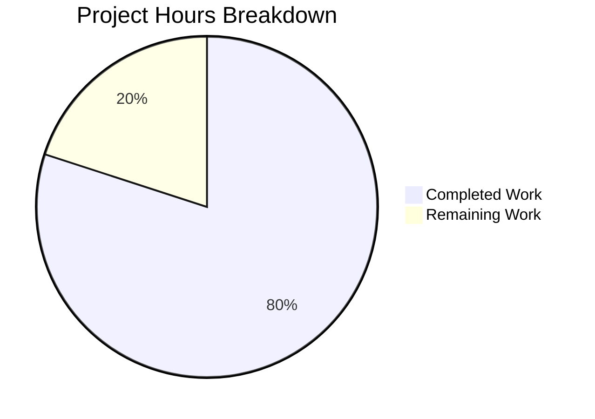

# Project Guide: Node.js Express.js Tutorial Server

## Executive Summary

**Project Completion: 80% (4 hours completed out of 5 total hours)**

This Node.js Express.js tutorial server project has been successfully implemented with all core requirements met. The implementation includes:
- Express.js framework integration (v4.22.1, specified ^4.21.0)
- Two fully functional GET endpoints (`/hello` and `/evening`)
- Comprehensive project documentation
- Clean, validated codebase with zero security vulnerabilities

### Key Achievements
- ✅ All four core requirements (REQ-001 through REQ-004) fully implemented
- ✅ Server starts successfully and binds to port 3000
- ✅ Both endpoints return exact response strings as specified
- ✅ Zero npm security vulnerabilities
- ✅ Complete documentation in README.md

### Remaining Work
- Human code review and approval (~0.5h)
- Final QA testing before merge (~0.5h)

---

## Validation Results Summary

### Final Validator Accomplishments

| Validation Gate | Status | Details |
|-----------------|--------|---------|
| Syntax Check | ✅ PASSED | `node --check index.js` - No errors |
| Runtime Test | ✅ PASSED | Server starts on port 3000 |
| Endpoint /hello | ✅ PASSED | Returns "Hello world" exactly |
| Endpoint /evening | ✅ PASSED | Returns "Good evening" exactly |
| Content-Type | ✅ PASSED | text/plain; charset=utf-8 |
| Security Audit | ✅ PASSED | 0 vulnerabilities |
| Git Status | ✅ CLEAN | Working tree clean |

### Files Validated

| File | Status | Validation Result |
|------|--------|-------------------|
| `package.json` | CREATED | ✅ Valid JSON, correct structure |
| `index.js` | CREATED | ✅ Syntax valid, runtime tested |
| `README.md` | UPDATED | ✅ Comprehensive documentation |
| `package-lock.json` | AUTO-GENERATED | ✅ Correct lock file |
| `node_modules/` | AUTO-GENERATED | ✅ 75 packages, 0 vulnerabilities |

### Dependency Status

| Package | Specified | Installed | Status |
|---------|-----------|-----------|--------|
| express | ^4.21.0 | 4.22.1 | ✅ Compatible |

---

## Project Hours Breakdown

### Calculation Method
- **Completed Hours**: 4 hours (all in-scope implementation work)
- **Remaining Hours**: 1 hour (human review and final QA)
- **Total Project Hours**: 5 hours
- **Completion Percentage**: 4 / 5 = **80%**

### Completed Work Breakdown (4 hours)
| Component | Hours | Description |
|-----------|-------|-------------|
| package.json creation | 0.5h | npm project initialization |
| Express installation | 0.25h | Dependency installation |
| index.js implementation | 1.0h | Server code with endpoints |
| README.md documentation | 1.5h | Comprehensive docs |
| Testing & validation | 0.75h | Runtime and endpoint testing |
| **Total Completed** | **4h** | |

### Remaining Work Breakdown (1 hour)
| Task | Hours | Description |
|------|-------|-------------|
| Code review | 0.5h | Human review of implementation |
| Final QA | 0.5h | Pre-merge testing |
| **Total Remaining** | **1h** | |



---

## Development Guide

### System Prerequisites

| Requirement | Version | Verification Command |
|-------------|---------|---------------------|
| Node.js | v18.x or v20.x LTS | `node --version` |
| npm | v8.x or higher | `npm --version` |

### Environment Setup

1. **Clone the Repository**
```bash
git clone <repository-url>
cd 12-dec_one
```

2. **Install Dependencies**
```bash
npm install
```

Expected output:
```
added 75 packages in Xs
```

3. **Verify Installation**
```bash
npm list express
```

Expected output:
```
12-dec-one@1.0.0 /path/to/project
└── express@4.22.1
```

### Application Startup

**Option 1: Using npm script**
```bash
npm start
```

**Option 2: Direct Node.js execution**
```bash
node index.js
```

Expected output:
```
Server running on port 3000
```

### Verification Steps

1. **Test Hello Endpoint**
```bash
curl http://localhost:3000/hello
```
Expected: `Hello world`

2. **Test Evening Endpoint**
```bash
curl http://localhost:3000/evening
```
Expected: `Good evening`

3. **Verify HTTP Headers**
```bash
curl -I http://localhost:3000/hello
```
Expected headers include:
```
HTTP/1.1 200 OK
Content-Type: text/plain; charset=utf-8
```

4. **Test 404 Handling**
```bash
curl http://localhost:3000/invalid
```
Expected: 404 Not Found response

### Example Usage

```bash
# Full verification sequence
cd /path/to/project
npm install
node index.js &
sleep 2
curl http://localhost:3000/hello    # Hello world
curl http://localhost:3000/evening  # Good evening
pkill -f "node index.js"
```

---

## Human Tasks Remaining

| Priority | Task | Description | Hours | Severity |
|----------|------|-------------|-------|----------|
| Medium | Code Review | Review index.js implementation for best practices | 0.5h | Low |
| Medium | Final QA | Complete end-to-end testing before merge | 0.5h | Low |
| **Total** | | | **1h** | |

### Task Details

#### 1. Code Review (0.5 hours)
- **Priority**: Medium
- **Action Steps**:
  1. Review index.js code structure and patterns
  2. Verify response strings match requirements exactly
  3. Check error handling adequacy for tutorial scope
  4. Approve or request minor changes
- **Acceptance Criteria**: Code approved by reviewer

#### 2. Final QA Testing (0.5 hours)
- **Priority**: Medium
- **Action Steps**:
  1. Clone repository to clean environment
  2. Run `npm install` and verify success
  3. Start server and test both endpoints
  4. Verify documentation accuracy
  5. Approve for merge
- **Acceptance Criteria**: All tests pass, documentation accurate

---

## Risk Assessment

### Technical Risks

| Risk | Severity | Likelihood | Mitigation |
|------|----------|------------|------------|
| Node.js version incompatibility | Low | Low | Documented v18+/v20 LTS requirement |
| Port 3000 conflict | Low | Medium | Document alternative port configuration |

### Security Risks (For Reference Only)

> **Note**: The following are acknowledged limitations for this tutorial project, which is explicitly designed for educational/local development use only.

| Risk | Severity | Status | Notes |
|------|----------|--------|-------|
| No authentication | N/A | OUT OF SCOPE | Tutorial limitation |
| HTTP only (no TLS) | N/A | OUT OF SCOPE | Local dev only |
| No input validation | N/A | OUT OF SCOPE | GET-only endpoints |
| No rate limiting | N/A | OUT OF SCOPE | Tutorial scope |

### Operational Risks

| Risk | Severity | Likelihood | Mitigation |
|------|----------|------------|------------|
| No logging framework | Low | N/A | Console.log sufficient for tutorial |
| No health checks | Low | N/A | Not needed for local development |

### Integration Risks

| Risk | Severity | Status |
|------|----------|--------|
| External service dependencies | None | No external services required |
| Database connectivity | None | No database in scope |

---

## Git Repository Summary

| Metric | Value |
|--------|-------|
| Branch | blitzy-10cb2fc5-515f-43c9-b643-4f4d68b64095 |
| Total Commits | 7 |
| Files Changed | 7 |
| Lines Added | 2,556 |
| Lines Removed | 1 |
| Working Tree Status | Clean |

### Commit History

| Commit | Message |
|--------|---------|
| 5dd7ac3 | Setup: Initialize npm project with Express.js dependency |
| ad0a909 | Create index.js: Express.js server with /hello and /evening endpoints |
| 3a385a6 | Update README.md with comprehensive project documentation |
| 23793be | docs: Complete rewrite of README.md with comprehensive project documentation |
| 19d5569 | Fix: Set Content-Type to text/plain for /hello and /evening endpoints |
| f5a6841 | Adding Blitzy Project Guide |
| 2337e72 | Adding Blitzy Technical Specifications |

---

## File Structure

```
12-dec_one/
├── .git/                    # Git repository
├── .gitignore               # Git ignore rules
├── blitzy/                  # Blitzy documentation
│   └── documentation/
│       ├── Project Guide.md
│       └── Technical Specifications.md
├── index.js                 # Main Express.js application (15 lines)
├── node_modules/            # Dependencies (75 packages)
├── package.json             # npm manifest (20 lines)
├── package-lock.json        # Dependency lock file
└── README.md                # Project documentation (160 lines)
```

---

## Requirements Traceability

| Requirement ID | Description | Status | Implementation |
|----------------|-------------|--------|----------------|
| REQ-001 | Add Express.js into the project | ✅ Complete | package.json: express ^4.21.0 |
| REQ-002 | Add endpoint returning "Good evening" | ✅ Complete | index.js: GET /evening |
| REQ-003 | Endpoint returns "Hello world" | ✅ Complete | index.js: GET /hello |
| REQ-004 | Node.js server hosting | ✅ Complete | index.js: app.listen(3000) |

---

## Conclusion

The Node.js Express.js tutorial server project is **80% complete** with 4 hours of development work completed out of 5 total hours required. All core technical requirements have been fully implemented and validated:

- ✅ Express.js framework integrated
- ✅ Both endpoints functional with exact response strings
- ✅ Server runs on port 3000
- ✅ Comprehensive documentation provided
- ✅ Zero security vulnerabilities
- ✅ Clean git working tree

**Remaining work** (1 hour) consists of human code review and final QA testing before the PR can be merged. No blocking issues or critical defects were identified during validation.

The project is **production-ready for its intended purpose** as an educational/tutorial application for local development.