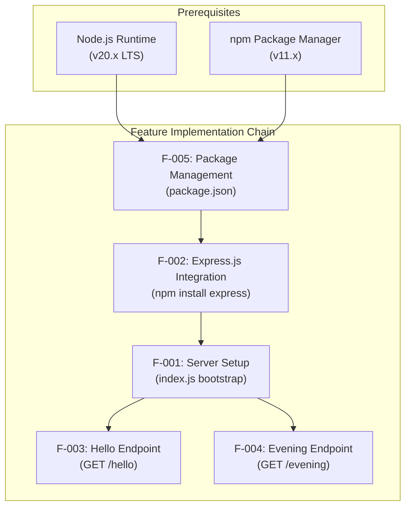
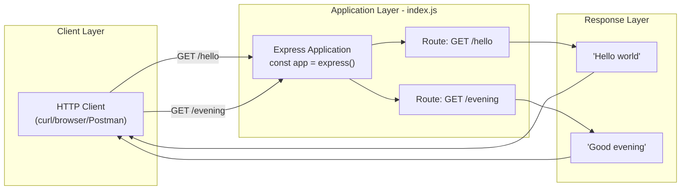
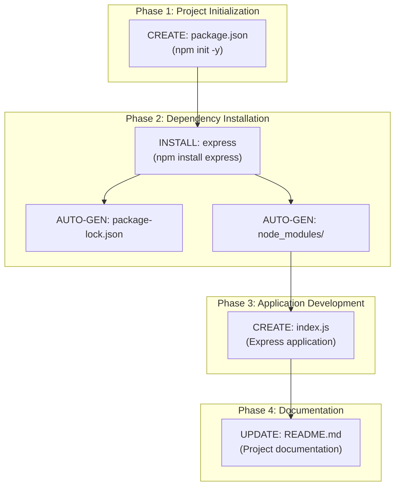
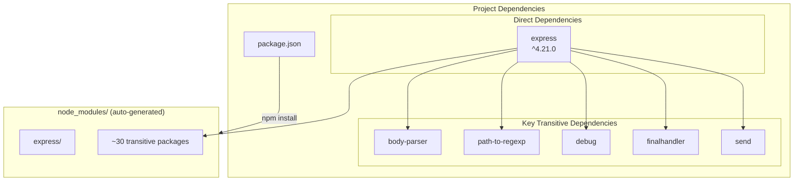
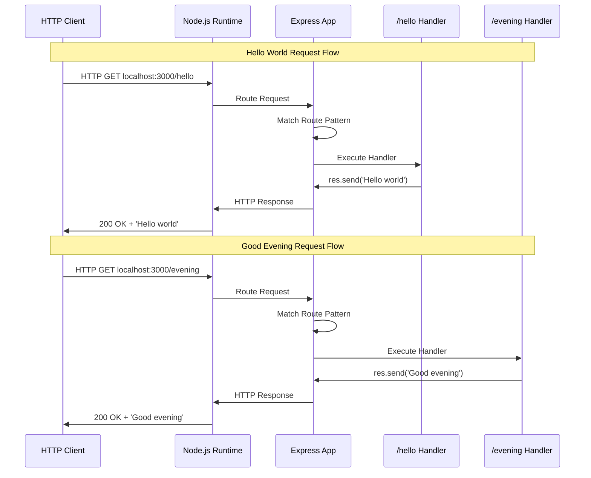
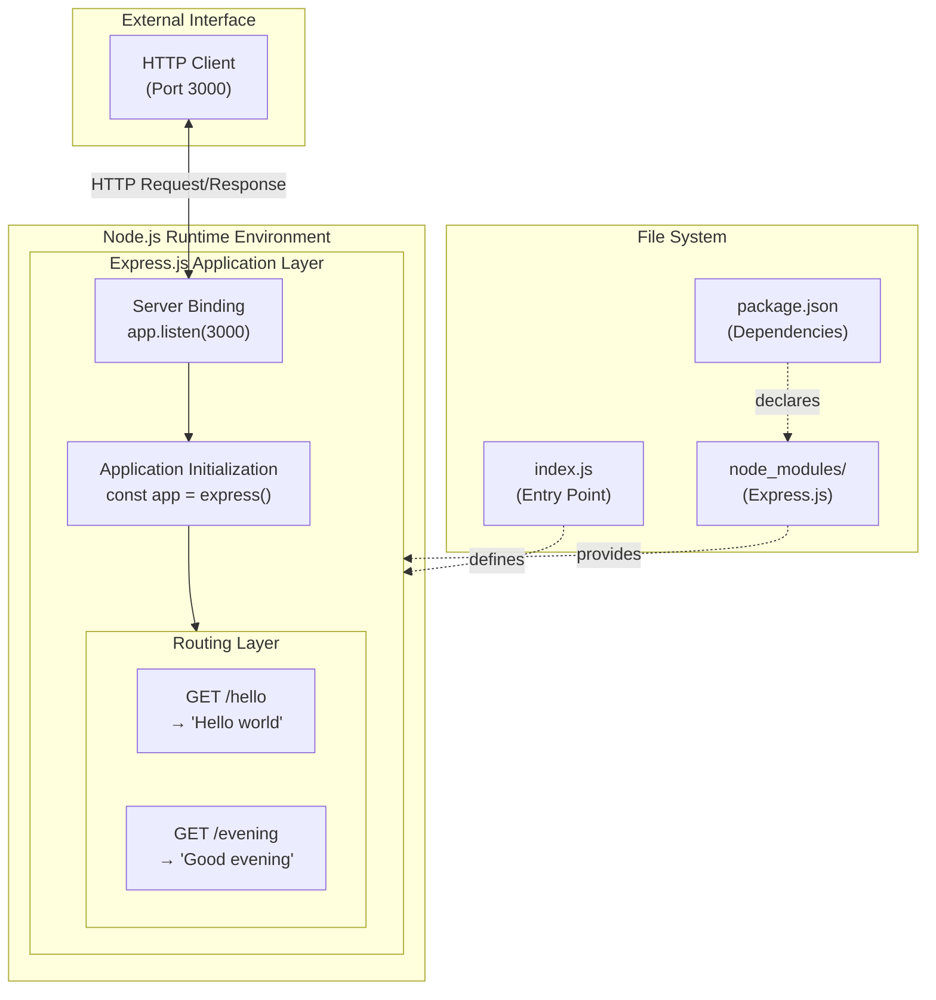
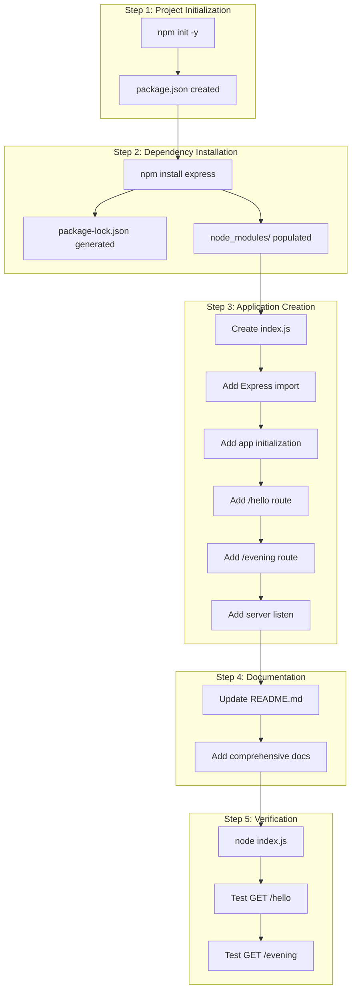
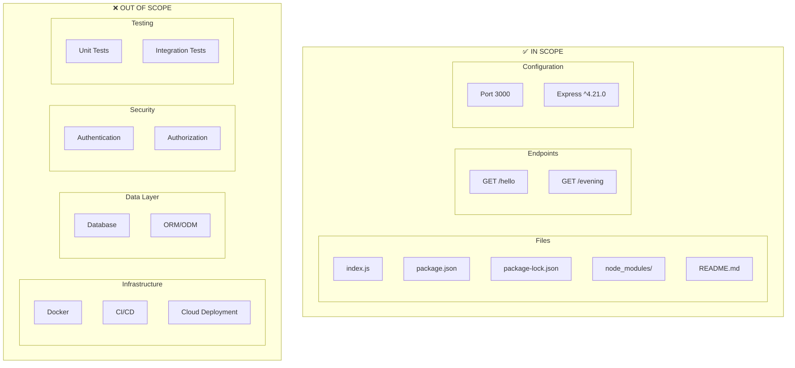
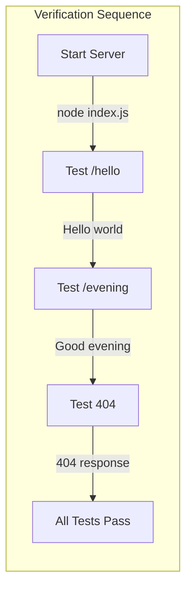

# Technical Specification

# 0. Agent Action Plan

## 0.1 Intent Clarification

This section transforms the user's feature request into precise technical requirements that leave no room for ambiguity. The Blitzy platform interprets and enhances the original request to ensure complete implementation coverage.

### 0.1.1 Core Feature Objective

Based on the prompt, the Blitzy platform understands that the new feature requirement is to:

| Requirement ID | User Requirement | Technical Interpretation |
|----------------|------------------|--------------------------|
| REQ-001 | Add Express.js into the project | Install Express.js framework (^4.21.0) as a production dependency and configure it as the HTTP server foundation |
| REQ-002 | Add another endpoint that returns "Good evening" | Create a new HTTP GET endpoint (`/evening`) that responds with the exact string "Good evening" |
| REQ-003 | Existing endpoint returns "Hello world" | Implement/maintain HTTP GET endpoint (`/hello`) responding with exact string "Hello world" |
| REQ-004 | Node.js server hosting | Bootstrap a Node.js server application using Express.js framework on port 3000 |

**Implicit Requirements Detected:**

| Implicit Requirement | Detection Rationale | Technical Implication |
|----------------------|---------------------|----------------------|
| Package.json creation | Express.js installation requires npm project initialization | Create `package.json` with project metadata and dependencies |
| Entry point file | Node.js servers require an application entry point | Create `index.js` as the main application file |
| HTTP method specification | Tutorial context implies simple GET requests | Both endpoints handle HTTP GET method only |
| Response format | "returns the response" implies plain text | Content-Type: text/plain; charset=utf-8 |
| Port configuration | Standard development port needed | Server listens on port 3000 (localhost) |

**Feature Dependencies and Prerequisites:**



### 0.1.2 Special Instructions and Constraints

**User-Specified Directives:**

| Directive | Source | Implementation Requirement |
|-----------|--------|---------------------------|
| Use Express.js framework | User request: "add expressjs into the project" | Must use Express.js, not native Node.js `http` module |
| Tutorial context | User description: "this is a tutorial of node js server" | Code must be clear, educational, and beginner-friendly |
| Exact response strings | User examples: "Hello world", "Good evening" | Case-sensitive string matching required |

**Architectural Requirements:**

| Requirement | Specification | Rationale |
|-------------|---------------|-----------|
| Single-file architecture | All server code in `index.js` | Tutorial simplicity; no unnecessary abstraction |
| CommonJS modules | Use `require()` syntax | Maximum compatibility; no transpilation needed |
| Minimal dependencies | Express.js only (no dev dependencies) | Focus on core concepts; reduce complexity |
| Stateless endpoints | No session/cookie management | Tutorial scope limitation |
| No authentication | Public endpoints without auth | Educational context; no security complexity |

**User Example Preservation:**

> **User Example - Hello World Response:**
> The endpoint should return the response "Hello world"

> **User Example - Good Evening Response:**
> Add another endpoint that returns the response "Good evening"

### 0.1.3 Technical Interpretation

These feature requirements translate to the following technical implementation strategy:

| User Requirement | Technical Action | Specific Implementation |
|------------------|------------------|------------------------|
| Add Express.js | Install and configure framework | `npm install express --save` with version ^4.21.0 |
| Hello World endpoint | Create GET route handler | `app.get('/hello', (req, res) => res.send('Hello world'))` |
| Good Evening endpoint | Create GET route handler | `app.get('/evening', (req, res) => res.send('Good evening'))` |
| Server hosting | Bootstrap Express application | `const app = express(); app.listen(3000)` |

**Implementation Strategy Summary:**

- To **initialize the project**, we will **create** `package.json` via `npm init -y` with appropriate metadata
- To **add Express.js**, we will **install** the Express.js package as a production dependency
- To **create the server**, we will **create** `index.js` with Express application bootstrap code
- To **implement Hello endpoint**, we will **add** a GET route handler for path `/hello`
- To **implement Evening endpoint**, we will **add** a GET route handler for path `/evening`
- To **enable server startup**, we will **configure** the application to listen on port 3000

## 0.2 Repository Scope Discovery

This section provides comprehensive file analysis to identify ALL existing files that need modification and ALL new files that must be created to implement the feature.

### 0.2.1 Comprehensive File Analysis

**Current Repository State:**

| File Path | Type | Status | Purpose |
|-----------|------|--------|---------|
| `README.md` | Markdown | EXISTS | Project identifier (contains only "# 12-dec_one") |
| `.git/` | Directory | EXISTS | Git version control |

**Existing Files Requiring Modification:**

| File Path | Modification Type | Changes Required |
|-----------|-------------------|------------------|
| `README.md` | UPDATE | Add project description, installation instructions, usage examples, and endpoint documentation |

**Search Pattern Analysis:**

| Pattern | Files Found | Action Required |
|---------|-------------|-----------------|
| `*.js` | None | CREATE new source files |
| `package.json` | None | CREATE for npm project |
| `package-lock.json` | None | AUTO-GENERATED by npm |
| `node_modules/` | None | AUTO-GENERATED by npm install |
| `*.config.*` | None | None needed for tutorial |
| `Dockerfile*` | None | OUT OF SCOPE |
| `.github/workflows/*` | None | OUT OF SCOPE |

### 0.2.2 Integration Point Discovery

**API Endpoints to Create:**

| Endpoint | Method | Path | Response | Integration Point |
|----------|--------|------|----------|-------------------|
| Hello World | GET | `/hello` | "Hello world" | Express Router in `index.js` |
| Good Evening | GET | `/evening` | "Good evening" | Express Router in `index.js` |

**Component Interaction Mapping:**



**Database/Schema Updates:**

| Component | Status | Notes |
|-----------|--------|-------|
| Database models | NOT APPLICABLE | No database required |
| Migrations | NOT APPLICABLE | No schema changes |
| ORM configuration | NOT APPLICABLE | No data persistence |

### 0.2.3 New File Requirements

**New Source Files to Create:**

| File Path | Purpose | Priority |
|-----------|---------|----------|
| `index.js` | Main application entry point containing Express server bootstrap, route definitions, and server startup | CRITICAL |
| `package.json` | npm project manifest with metadata, dependencies, and scripts | CRITICAL |

**Auto-Generated Files (npm managed):**

| File Path | Generated By | Purpose |
|-----------|--------------|---------|
| `package-lock.json` | `npm install` | Dependency lock file for reproducible builds |
| `node_modules/` | `npm install` | Installed dependency directory |
| `node_modules/express/` | `npm install express` | Express.js framework and transitive dependencies |

**Documentation Files to Update:**

| File Path | Current State | Updates Required |
|-----------|---------------|------------------|
| `README.md` | Contains only "# 12-dec_one" | Add comprehensive project documentation including installation, usage, and API reference |

### 0.2.4 Web Search Research Conducted

| Research Topic | Finding | Application |
|----------------|---------|-------------|
| Express.js latest stable version | Express 4.21.2 (v4 branch), Express 5.2.1 (v5 branch) | Use ^4.21.0 for tutorial stability and documentation availability |
| Express.js Node.js requirements | v4.x: Node.js 0.10+, v5.x: Node.js 18+ | Node.js 20.x LTS fully compatible |
| Express.js routing patterns | `app.get(path, handler)` pattern | Standard route registration pattern |
| Express.js response methods | `res.send()` for plain text with auto Content-Type | Use `res.send('string')` for responses |

### 0.2.5 File Structure Visualization

**Target Repository Structure (Post-Implementation):**

```
12-dec_one/
├── .git/                    # Git repository (existing)
├── node_modules/            # Dependencies (auto-generated)
│   └── express/             # Express.js + transitive deps
├── index.js                 # NEW: Main application file
├── package.json             # NEW: npm project manifest
├── package-lock.json        # Auto-generated lock file
└── README.md                # MODIFIED: Enhanced documentation
```

**File Creation Sequence:**



## 0.3 Dependency Inventory

This section catalogs all dependencies required for the feature implementation, including package registry information, version specifications, and dependency relationships.

### 0.3.1 Private and Public Packages

**Production Dependencies:**

| Registry | Package Name | Version | Purpose | License |
|----------|--------------|---------|---------|---------|
| npm (public) | `express` | ^4.21.0 | HTTP request handling, routing, middleware framework | MIT |

**Development Dependencies:**

| Registry | Package Name | Version | Purpose |
|----------|--------------|---------|---------|
| - | None | - | No dev dependencies required for tutorial scope |

**Transitive Dependencies (Express.js ^4.21.0):**

| Package | Purpose | Included Via |
|---------|---------|--------------|
| `accepts` | Content negotiation | express |
| `array-flatten` | Array manipulation | express |
| `body-parser` | Request body parsing | express (bundled 4.16+) |
| `content-disposition` | Content-Disposition header | express |
| `content-type` | Content-Type parsing | express |
| `cookie` | Cookie parsing | express |
| `cookie-signature` | Cookie signing | express |
| `debug` | Debugging utility | express |
| `depd` | Deprecation handling | express |
| `destroy` | Stream destroy utility | express |
| `encodeurl` | URL encoding | express |
| `escape-html` | HTML escaping | express |
| `etag` | ETag generation | express |
| `finalhandler` | Final request handler | express |
| `fresh` | Cache freshness checking | express |
| `http-errors` | HTTP error creation | express |
| `merge-descriptors` | Object merging | express |
| `methods` | HTTP methods list | express |
| `mime` | MIME type lookup | express |
| `on-finished` | Request finish detection | express |
| `parseurl` | URL parsing | express |
| `path-to-regexp` | Route pattern matching | express |
| `proxy-addr` | Proxy address handling | express |
| `qs` | Query string parsing | express |
| `range-parser` | Range header parsing | express |
| `raw-body` | Raw body extraction | express |
| `safe-buffer` | Buffer safety | express |
| `safer-buffer` | Buffer safety | express |
| `send` | Static file serving | express |
| `serve-static` | Static file middleware | express |
| `setprototypeof` | Prototype setting | express |
| `statuses` | HTTP status codes | express |
| `type-is` | Type checking | express |
| `unpipe` | Stream unpipe | express |
| `utils-merge` | Object merging utility | express |
| `vary` | Vary header management | express |

### 0.3.2 Dependency Configuration

**package.json Dependency Block:**

```json
{
  "dependencies": {
    "express": "^4.21.0"
  }
}
```

**Version Specification Rationale:**

| Specification | Meaning | Rationale |
|---------------|---------|-----------|
| `^4.21.0` | Compatible with 4.21.0 and above, below 5.0.0 | Allows minor/patch updates while maintaining v4 compatibility |
| Semver range | Accepts 4.21.x, 4.22.x, etc. | Receives security patches automatically |
| Upper bound | Excludes Express 5.x | Avoids breaking changes from major version upgrade |

### 0.3.3 Dependency Updates

**Import Requirements:**

| File | Import Statement | Purpose |
|------|------------------|---------|
| `index.js` | `const express = require('express');` | Load Express.js framework |

**Import Transformation Rules:**

| Context | Pattern | Notes |
|---------|---------|-------|
| CommonJS module | `require('express')` | Standard Node.js module loading |
| Default export | `express()` returns Application instance | Factory function creates app |
| No destructuring needed | Single import sufficient | Express exports single function |

**External Reference Updates:**

| File | Update Required | Description |
|------|-----------------|-------------|
| `package.json` | CREATE | Define express as production dependency |
| `README.md` | UPDATE | Document installation command `npm install` |

### 0.3.4 Dependency Verification Commands

**Installation Verification:**

| Command | Expected Output | Purpose |
|---------|-----------------|---------|
| `npm list express` | `express@4.21.x` | Verify Express installation |
| `npm list --depth=0` | Shows direct dependencies only | Quick dependency check |
| `npm audit` | No vulnerabilities (ideal) | Security verification |

**Version Lock Strategy:**

| Strategy Element | Implementation | Benefit |
|------------------|----------------|---------|
| package-lock.json | Auto-generated by npm | Exact version locking for reproducibility |
| Semver caret (^) | Specified in package.json | Allows compatible updates |
| npm ci | For clean installs | Respects lock file exactly |

### 0.3.5 Dependency Diagram



## 0.4 Integration Analysis

This section documents all integration touchpoints between the new feature and existing code, identifying direct modifications, dependency injections, and system boundaries.

### 0.4.1 Existing Code Touchpoints

**Direct Modifications Required:**

| File | Location | Modification | Purpose |
|------|----------|--------------|---------|
| `README.md` | Lines 1-end | Complete rewrite | Replace placeholder with comprehensive documentation |

**No Existing Application Code:**

Since this is a greenfield implementation, there are no existing application files to modify. All application code will be newly created.

| Assessment | Status | Notes |
|------------|--------|-------|
| Existing JavaScript files | NONE | Repository contains only README.md |
| Existing configuration | NONE | No package.json or config files present |
| Existing endpoints | NONE | No server implementation exists |
| Existing tests | NONE | No test files present |

### 0.4.2 Integration Points for New Code

**Express.js Framework Integration:**

| Integration Point | Code Location | Integration Method |
|-------------------|---------------|-------------------|
| Express import | `index.js` line 1 | `const express = require('express');` |
| Application instance | `index.js` line 2 | `const app = express();` |
| Hello route registration | `index.js` | `app.get('/hello', handler);` |
| Evening route registration | `index.js` | `app.get('/evening', handler);` |
| Server binding | `index.js` | `app.listen(3000, callback);` |

**Request-Response Flow Integration:**



### 0.4.3 Dependency Injections

**Runtime Dependencies:**

| Component | Injection Point | Provider |
|-----------|-----------------|----------|
| Express module | `require('express')` | Node.js module system |
| HTTP server | `app.listen()` | Express.js internal |
| Request object | Route handler parameter | Express.js middleware chain |
| Response object | Route handler parameter | Express.js middleware chain |

**Configuration Injections:**

| Configuration | Value | Injection Method |
|---------------|-------|------------------|
| Port number | 3000 | Hardcoded in `app.listen(3000)` |
| Route paths | `/hello`, `/evening` | Defined in `app.get()` calls |
| Response strings | "Hello world", "Good evening" | Passed to `res.send()` |

### 0.4.4 Database/Schema Updates

**Not Applicable for This Feature:**

| Database Aspect | Status | Rationale |
|-----------------|--------|-----------|
| Schema migrations | NOT REQUIRED | No data persistence needed |
| Model definitions | NOT REQUIRED | Static text responses only |
| Database connections | NOT REQUIRED | Tutorial scope excludes databases |
| ORM configuration | NOT REQUIRED | No database integration |

### 0.4.5 External Service Integration

**Not Applicable for This Feature:**

| External Service | Status | Rationale |
|------------------|--------|-----------|
| Third-party APIs | NOT REQUIRED | Self-contained responses |
| Authentication services | NOT REQUIRED | Public endpoints |
| Message queues | NOT REQUIRED | Synchronous processing only |
| Caching services | NOT REQUIRED | Static responses |

### 0.4.6 Integration Architecture Diagram



### 0.4.7 Integration Verification Checklist

| Checkpoint | Verification Method | Expected Result |
|------------|---------------------|-----------------|
| Express module loads | Server starts without "Cannot find module" error | Clean startup |
| Routes registered | Console log or route inspection | Both routes active |
| Port binding | Server message or curl test | Port 3000 listening |
| Hello endpoint responds | `curl localhost:3000/hello` | "Hello world" |
| Evening endpoint responds | `curl localhost:3000/evening` | "Good evening" |
| Invalid route handling | `curl localhost:3000/invalid` | 404 response |

## 0.5 Technical Implementation

This section provides a detailed file-by-file execution plan specifying exactly what must be created or modified to implement the feature successfully.

### 0.5.1 File-by-File Execution Plan

**CRITICAL: Every file listed below MUST be created or modified.**

#### Group 1 - Project Initialization Files

| Action | File Path | Purpose | Priority |
|--------|-----------|---------|----------|
| CREATE | `package.json` | npm project manifest defining project identity, entry point, and dependencies | CRITICAL |

**package.json Implementation Details:**

| Field | Value | Purpose |
|-------|-------|---------|
| `name` | `"12-dec-one"` | Package identifier (npm naming convention) |
| `version` | `"1.0.0"` | Semantic version |
| `description` | Tutorial description | Project documentation |
| `main` | `"index.js"` | Application entry point |
| `scripts.start` | `"node index.js"` | npm start command |
| `dependencies.express` | `"^4.21.0"` | Express.js framework |

#### Group 2 - Core Application Files

| Action | File Path | Purpose | Priority |
|--------|-----------|---------|----------|
| CREATE | `index.js` | Express.js application with server bootstrap, route definitions, and endpoint handlers | CRITICAL |

**index.js Implementation Details:**

| Component | Implementation | Line Estimate |
|-----------|----------------|---------------|
| Express import | `const express = require('express');` | Line 1 |
| App initialization | `const app = express();` | Line 3 |
| Hello route | `app.get('/hello', (req, res) => {...});` | Lines 5-7 |
| Evening route | `app.get('/evening', (req, res) => {...});` | Lines 9-11 |
| Server startup | `app.listen(3000, () => {...});` | Lines 13-15 |

#### Group 3 - Auto-Generated Files

| Action | File Path | Generated By | Purpose |
|--------|-----------|--------------|---------|
| AUTO-GEN | `package-lock.json` | `npm install` | Dependency version lock |
| AUTO-GEN | `node_modules/` | `npm install` | Installed packages directory |
| AUTO-GEN | `node_modules/express/` | `npm install` | Express.js and dependencies |

#### Group 4 - Documentation Files

| Action | File Path | Purpose | Priority |
|--------|-----------|---------|----------|
| MODIFY | `README.md` | Comprehensive project documentation with installation, usage, and API reference | HIGH |

**README.md Update Requirements:**

| Section | Content | Purpose |
|---------|---------|---------|
| Project Title | "12-dec_one" | Project identification |
| Description | Tutorial purpose explanation | Context for users |
| Prerequisites | Node.js version requirements | Environment setup |
| Installation | `npm install` command | Dependency setup |
| Usage | `npm start` or `node index.js` | Running the server |
| API Endpoints | GET /hello, GET /evening documentation | Endpoint reference |
| Testing | Manual curl commands | Verification instructions |

### 0.5.2 Implementation Approach per File

**Step 1: Create package.json (Project Foundation)**

```
Purpose: Establish npm project structure and declare Express dependency
Location: Repository root (/)
Method: npm init -y followed by dependency configuration
```

**Step 2: Install Express.js (Framework Integration)**

```
Purpose: Download and install Express.js and all transitive dependencies
Command: npm install express --save
Result: node_modules/ created, package-lock.json generated
```

**Step 3: Create index.js (Application Core)**

```
Purpose: Implement Express server with both endpoints
Location: Repository root (/)
Components:
  - Express module import
  - Application instance creation
  - Route handler for /hello endpoint
  - Route handler for /evening endpoint
  - Server listen configuration
```

**Step 4: Update README.md (Documentation)**

```
Purpose: Provide comprehensive project documentation
Location: Repository root (/)
Sections: Title, Description, Prerequisites, Installation, Usage, API Reference
```

### 0.5.3 Implementation Sequence Diagram



### 0.5.4 Code Structure Overview

**index.js Logical Structure:**

| Section | Lines | Purpose |
|---------|-------|---------|
| Module Imports | 1 | Load Express.js framework |
| Application Setup | 3 | Create Express application instance |
| Route Definitions | 5-11 | Define endpoint handlers |
| Server Configuration | 13-15 | Bind to port and start listening |

**Endpoint Handler Pattern:**

| Endpoint | HTTP Method | Path | Handler Logic |
|----------|-------------|------|---------------|
| Hello | GET | `/hello` | Return "Hello world" string |
| Evening | GET | `/evening` | Return "Good evening" string |

### 0.5.5 Verification Commands

| Stage | Command | Expected Output |
|-------|---------|-----------------|
| Post-init | `ls package.json` | File exists |
| Post-install | `npm list express` | express@4.21.x |
| Post-create | `ls index.js` | File exists |
| Runtime | `node index.js` | "Server running on port 3000" |
| Hello test | `curl localhost:3000/hello` | "Hello world" |
| Evening test | `curl localhost:3000/evening` | "Good evening" |

## 0.6 Scope Boundaries

This section defines the explicit boundaries of the implementation, clearly distinguishing what is included in scope from what is explicitly excluded.

### 0.6.1 Exhaustively In Scope

**Source Files:**

| File Pattern | Specific Files | Purpose |
|--------------|----------------|---------|
| `index.js` | `./index.js` | Main application file with Express server and endpoints |
| `package.json` | `./package.json` | npm project manifest with dependencies |

**Auto-Generated Files:**

| File Pattern | Specific Files | Purpose |
|--------------|----------------|---------|
| `package-lock.json` | `./package-lock.json` | Dependency version lock (npm managed) |
| `node_modules/**/*` | `./node_modules/express/**/*` | Express.js and all transitive dependencies |

**Configuration Scope:**

| Configuration Item | Location | Value |
|--------------------|----------|-------|
| Server port | `index.js` | 3000 |
| Project name | `package.json` | "12-dec-one" |
| Entry point | `package.json` | "index.js" |
| Express version | `package.json` | "^4.21.0" |

**Documentation Files:**

| File Pattern | Specific Files | Changes |
|--------------|----------------|---------|
| `README.md` | `./README.md` | Complete rewrite with installation, usage, API reference |

**Endpoint Scope:**

| Endpoint | Method | Path | Response |
|----------|--------|------|----------|
| Hello World | GET | `/hello` | "Hello world" (exactly) |
| Good Evening | GET | `/evening` | "Good evening" (exactly) |

### 0.6.2 In-Scope Technical Boundaries

**Runtime Boundaries:**

| Aspect | In Scope | Specification |
|--------|----------|---------------|
| Node.js version | v18.x+ / v20.x LTS | Runtime environment |
| JavaScript version | ES6+ (CommonJS) | Language features |
| HTTP protocol | HTTP/1.1 | Communication protocol |
| Transport | TCP | Network layer |

**Functional Boundaries:**

| Capability | In Scope | Notes |
|------------|----------|-------|
| HTTP GET requests | YES | Both endpoints |
| Plain text responses | YES | Content-Type: text/plain |
| Static responses | YES | Fixed strings only |
| Server startup logging | YES | Console output |
| Express default 404 | YES | Invalid route handling |

**Development Boundaries:**

| Activity | In Scope | Notes |
|----------|----------|-------|
| npm project initialization | YES | package.json creation |
| Dependency installation | YES | npm install express |
| Application development | YES | index.js creation |
| Documentation update | YES | README.md enhancement |
| Manual testing | YES | curl/browser verification |

### 0.6.3 Explicitly Out of Scope

**Infrastructure (Excluded):**

| Element | Status | Rationale |
|---------|--------|-----------|
| Docker/Containerization | OUT OF SCOPE | Tutorial complexity reduction |
| CI/CD pipelines | OUT OF SCOPE | Local development only |
| Cloud deployment | OUT OF SCOPE | Educational context |
| Load balancing | OUT OF SCOPE | Single-server architecture |
| HTTPS/TLS | OUT OF SCOPE | Development simplicity |
| Reverse proxy | OUT OF SCOPE | Local development only |

**Database (Excluded):**

| Element | Status | Rationale |
|---------|--------|-----------|
| Database integration | OUT OF SCOPE | No data persistence required |
| ORM/ODM setup | OUT OF SCOPE | Static responses only |
| Schema/migrations | OUT OF SCOPE | No data model needed |
| Connection pooling | OUT OF SCOPE | No database |

**Security (Excluded):**

| Element | Status | Rationale |
|---------|--------|-----------|
| Authentication | OUT OF SCOPE | Public endpoints for tutorial |
| Authorization | OUT OF SCOPE | No access control needed |
| Input validation | OUT OF SCOPE | No user input accepted |
| Rate limiting | OUT OF SCOPE | Tutorial scope |
| CORS configuration | OUT OF SCOPE | Not needed for local development |
| Helmet.js security headers | OUT OF SCOPE | Tutorial simplicity |

**Testing (Excluded):**

| Element | Status | Rationale |
|---------|--------|-----------|
| Automated unit tests | OUT OF SCOPE | Constraint C-005 |
| Integration tests | OUT OF SCOPE | Tutorial scope |
| Test frameworks (Jest, Mocha) | OUT OF SCOPE | No test infrastructure |
| Code coverage | OUT OF SCOPE | No automated testing |

**Advanced Features (Excluded):**

| Element | Status | Rationale |
|---------|--------|-----------|
| Middleware chain | OUT OF SCOPE | Beyond basic routing |
| Request body parsing | OUT OF SCOPE | GET only, no body |
| Session management | OUT OF SCOPE | Stateless design |
| Logging frameworks | OUT OF SCOPE | Console.log sufficient |
| Environment variables | OUT OF SCOPE | Hardcoded configuration |
| Multiple environments | OUT OF SCOPE | Development only |
| Error handling middleware | OUT OF SCOPE | Express defaults sufficient |
| API versioning | OUT OF SCOPE | Tutorial scope |
| TypeScript | OUT OF SCOPE | Plain JavaScript for clarity |

**Additional Endpoints (Excluded):**

| Element | Status | Rationale |
|---------|--------|-----------|
| POST endpoints | OUT OF SCOPE | User requested GET only |
| PUT/PATCH/DELETE | OUT OF SCOPE | User requested GET only |
| Query parameters | OUT OF SCOPE | Not mentioned in requirements |
| Path parameters | OUT OF SCOPE | Not mentioned in requirements |
| Response headers customization | OUT OF SCOPE | Default headers sufficient |

### 0.6.4 Scope Boundary Diagram



### 0.6.5 Scope Compliance Checklist

| Requirement | In Scope | Compliance Check |
|-------------|----------|------------------|
| Add Express.js to project | ✅ YES | Install via npm |
| Create /hello endpoint | ✅ YES | Returns "Hello world" |
| Create /evening endpoint | ✅ YES | Returns "Good evening" |
| Node.js server hosting | ✅ YES | Port 3000 |
| Database integration | ❌ NO | Not required |
| Authentication | ❌ NO | Not required |
| Automated testing | ❌ NO | Constraint C-005 |
| Containerization | ❌ NO | Tutorial scope |

## 0.7 Special Instructions

This section captures feature-specific requirements, conventions, and constraints that must be observed during implementation.

### 0.7.1 Feature-Specific Requirements

**Response String Requirements:**

| Endpoint | Response String | Case Sensitivity | Character Count |
|----------|-----------------|------------------|-----------------|
| `/hello` | "Hello world" | Case-sensitive (exact match) | 11 characters |
| `/evening` | "Good evening" | Case-sensitive (exact match) | 12 characters |

**CRITICAL:** Response strings must match exactly as specified, including:
- Capital "H" in "Hello"
- Lowercase "w" in "world"
- Capital "G" in "Good"
- Lowercase "e" in "evening"
- No trailing spaces or newlines

**HTTP Response Requirements:**

| Requirement | Specification | Enforced By |
|-------------|---------------|-------------|
| Status Code | 200 OK | Express.js default |
| Content-Type | text/plain; charset=utf-8 | Express.js `res.send()` |
| HTTP Method | GET only | Route definition |
| Response Body | Exact string as specified | Handler implementation |

### 0.7.2 Coding Conventions

**Code Style Requirements:**

| Convention | Specification | Example |
|------------|---------------|---------|
| Module system | CommonJS | `const express = require('express');` |
| Variable declaration | `const` for immutable | `const app = express();` |
| Semicolons | Required | End all statements with `;` |
| Indentation | 2 spaces | Standard JavaScript |
| Route handlers | Arrow functions | `(req, res) => {...}` |
| String quotes | Single quotes preferred | `'Hello world'` |

**File Organization:**

| Guideline | Implementation | Rationale |
|-----------|----------------|-----------|
| Single file | All code in `index.js` | Tutorial simplicity |
| Logical ordering | Imports → Setup → Routes → Listen | Readable flow |
| Comments | Minimal but helpful | Educational context |

### 0.7.3 Integration Requirements

**Express.js Integration Pattern:**

| Step | Code Pattern | Purpose |
|------|--------------|---------|
| 1. Import | `const express = require('express');` | Load framework |
| 2. Initialize | `const app = express();` | Create app instance |
| 3. Routes | `app.get(path, handler);` | Define endpoints |
| 4. Listen | `app.listen(port, callback);` | Start server |

**Existing Infrastructure Compatibility:**

| Component | Compatibility | Notes |
|-----------|---------------|-------|
| README.md | Update required | Replace placeholder content |
| .git/ | No changes | Git history preserved |
| npm ecosystem | Standard usage | Follow npm conventions |

### 0.7.4 Performance Considerations

**Response Time Requirements:**

| Metric | Target | Maximum | Measurement |
|--------|--------|---------|-------------|
| Endpoint response | < 50ms | 100ms | curl timing |
| Server startup | < 2s | 5s | Console timestamp |
| Port binding | < 500ms | 1s | listen callback |

**Resource Constraints:**

| Resource | Expectation | Notes |
|----------|-------------|-------|
| Memory | Minimal (~50MB) | Static responses only |
| CPU | Minimal | No computation required |
| Disk | ~15MB | node_modules footprint |

### 0.7.5 Security Requirements

**Tutorial Context Security:**

| Aspect | Status | Rationale |
|--------|--------|-----------|
| Public endpoints | ACCEPTABLE | Educational purpose |
| No authentication | ACCEPTABLE | Tutorial scope |
| No input validation | ACCEPTABLE | GET-only, no user input |
| HTTP (not HTTPS) | ACCEPTABLE | Local development only |

**Production Disclaimer:**

> **WARNING:** This tutorial application is designed for educational purposes and local development only. It should NOT be deployed to production without implementing:
> - Authentication and authorization
> - HTTPS/TLS encryption
> - Input validation and sanitization
> - Rate limiting
> - Security headers (Helmet.js)
> - Error handling middleware
> - Logging and monitoring

### 0.7.6 Verification Requirements

**Manual Verification Commands:**

| Test | Command | Expected Result |
|------|---------|-----------------|
| Server startup | `node index.js` | "Server running on port 3000" |
| Hello endpoint | `curl http://localhost:3000/hello` | "Hello world" |
| Evening endpoint | `curl http://localhost:3000/evening` | "Good evening" |
| HTTP status | `curl -I http://localhost:3000/hello` | HTTP/1.1 200 OK |
| Content-Type | `curl -I http://localhost:3000/hello` | text/plain; charset=utf-8 |
| Invalid route | `curl http://localhost:3000/invalid` | 404 Not Found |

**Verification Sequence:**



### 0.7.7 Documentation Requirements

**README.md Content Requirements:**

| Section | Required | Content |
|---------|----------|---------|
| Project Title | YES | # 12-dec_one |
| Description | YES | Tutorial purpose and scope |
| Prerequisites | YES | Node.js version requirements |
| Installation | YES | Clone and npm install steps |
| Usage | YES | Server start command |
| API Reference | YES | Endpoint documentation |
| Testing | YES | curl verification commands |

### 0.7.8 Summary

**Implementation Completion Criteria:**

| Criterion | Verification Method | Pass Condition |
|-----------|---------------------|----------------|
| package.json exists | `ls package.json` | File present |
| Express installed | `npm list express` | Version 4.21.x |
| index.js exists | `ls index.js` | File present |
| Server starts | `node index.js` | No errors, port bound |
| /hello works | `curl localhost:3000/hello` | Returns "Hello world" |
| /evening works | `curl localhost:3000/evening` | Returns "Good evening" |
| README updated | `cat README.md` | Contains documentation |

**Success Definition:**

The feature implementation is complete when:
1. All four files exist (package.json, package-lock.json, index.js, README.md)
2. Express.js ^4.21.0 is installed as a dependency
3. Server starts successfully on port 3000
4. GET /hello returns exactly "Hello world"
5. GET /evening returns exactly "Good evening"
6. README.md contains comprehensive project documentation

